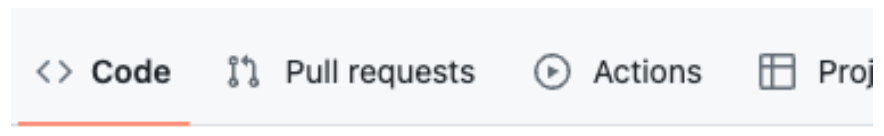
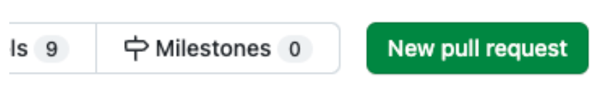
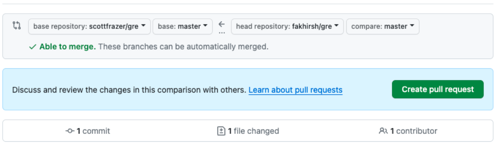

# Programming 2: Lab 07

## Git / Github (Time: 3 hours)

### Quiz Game: "Trivia Trek"

In "Trivia Trek," players progress through a series of quiz questions from various categories. Each correct answer earns points and allows the player to move to the next question. The game continues until a set number of rounds are completed, or a "game over" condition is met (e.g., three incorrect answers).

### Before you begin

This is a group lab with 2 people or maximum 3 people per group. _**If a group has only 2 people then they can either divide the 3rd member's tasks between themselves or they can skip those completely and just do their own tasks.**_

### Important steps:

1. Nominate a **team leader** : {student A, student B or student C}
2. This document assumes the team leader to be **student A**.
3. The team leader will create a new repository called **lab2** in their github account.
4. **student B** and **student C** will **"fork"** this repository **_(they will NOT create their own from scratch)_**

### Task Breakdown

Each member will be responsible for different aspects of the game, with tasks designed to be of comparable difficulty and complexity.

### Common Setup for All Members

**Task 1:** Clone the repository to their respective local machines.
```
git clone <repo address>
```

**Task 2:** Create a new branch called features:

To create and checkout a new branch:
```
git checkout -b features
```

## First Steps

### Student A (team lead):

Create two files in the root directory called:
- `game_mechanics.py`
- `main.py`

### Student B:

Create a file in the root directory called:
- `question_bank.py`

### Student C:

Create a file in the root directory called:
- `user_experience.py`

### All Students A, B and C:

Make sure you've checked out the **"features"** branch before adding anything to the repository.
Now add the above files to your respective temporary branch:
```
git add .
```

And commit changes:
```
git commit -am "file(s) added"
```

Merge it with the main branch:
```
git checkout main
git merge features
```

Finally push the main branch to the server:
```
git push origin main
```

Verify that the changes are reflected on your github account.

### Student B and C:

Execute the following command:
```
git pull
```
to see the latest changes applied to your local repositories as made by your team leader student A.

## Student B and C:

So far you've pushed the changes to your own forked repository. You need to reflect that onto your team lead's repository.

### Important step:

- Go to your github account, and to your forked repository.
- Goto "pull requests" near the upper left corner of the page:



- Then click on "New pull request":



- And then click on "Create pull request":



This will create a new pull request for your team lead's repository.

## Student A (team lead):

- Goto "Pull requests":


If there are any pending pull requests, review the code and merge them with your main branch.

## Student B and C:

Execute the following command:
```
git pull
```
to see the latest changes applied to your local repositories as made by your team leader student A and this time potentially other members of the team.

## Next Phase

### Student A's Tasks (`game_mechanics.py`):

1. Write a function to display the game's welcome message.
2. Implement a function to ask the player to choose a category.
3. Create a function to display the current score and round number.
4. Write a function to display a "game over" message along with the final score.
5. Implement a basic loop to run the game for 5 rounds.
6. Create a list of quiz categories.
7. Write a function to validate the player's answer (correct or incorrect).
8. Implement a scoring system, where each correct answer rewards points.
9. Create a function to increase the round number after each question.
10. Implement a "game over" condition if the player makes 3 incorrect answers.
11. Write a simple function to restart the game or exit after the game is over.
12. Document the game mechanics and functions with comments.

### Student B's Tasks (`question_bank.py`):

1. Create a list to store quiz questions for one category.
2. Write a function to select a random question from the list.
3. Populate the list with 10 questions (simple strings) for the chosen category.
4. Create a corresponding list of answers (correct answers) for the questions.
5. Implement a function to check if the player's answer matches the correct answer.
6. Write a function to remove a question from the list once it has been asked.
7. Create lists for two more categories, each with 10 questions and answers.
8. Write a function to display a question to the player and accept their answer via input.
9. Implement a hint system, offering a hint for each question.
10. Write a function to display the correct answer if the player's answer is incorrect.
11. Document the question bank and related functions with comments.
12. Ensure questions cover different difficulty levels (easy, medium, hard).

### Student C's Tasks (`user_experience.py`):

1. Implement a function to allow players to choose the difficulty level (affects the points awarded).
2. Write a function to display a leaderboard (top scores).
3. Create a simple text-based user interface for the game.
4. Implement a function to save the player's score to a file.
5. Write a function to load the top scores from the file.
6. Create a function that gives the player feedback after each round (e.g., "Great job!" or "Try again!").
7. Implement a timer for each question, with time affecting the score.
8. Write a function for a 50/50 lifeline (removes two incorrect answers).
9. Implement a function to allow players to skip a question once per game.
10. Document the user experience enhancements and additional features with comments.
11. Ensure the game is accessible and provides clear instructions for players.
12. Test the game thoroughly to ensure all features work as intended.

## Skeletal code

Starter code is given as **`lab07_starter.zip`**, containing all skeletal files mentioned above. Each student has to implement their own files and collaborate with the team members.

## Submission

You must commit your changes to the main branch of your repository. The final submission will be the **MAIN BRANCH** of your repository.